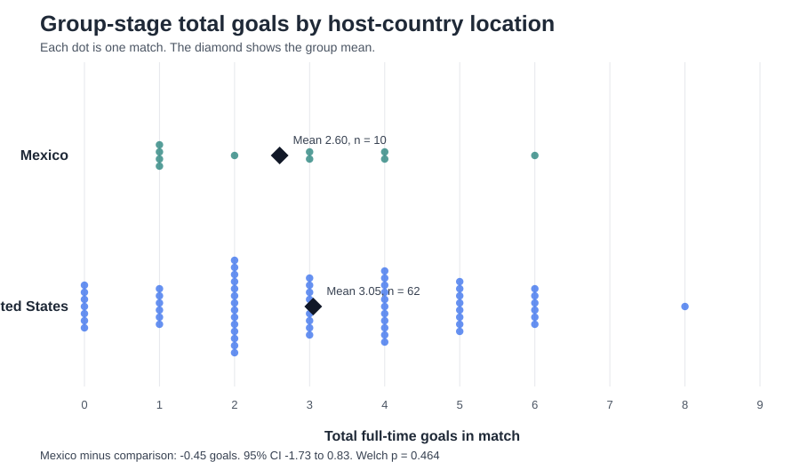

# Analytic task: Did match location relate to scoring?

**Member:** Akalanka Akash

## Research question

Did group-stage matches played in Mexico have a different mean number of total goals than group-stage matches played in Canada or the United States?

The question examines whether match location was related to scoring. Total goals show how high-scoring each match was. Only group-stage matches were included because knockout matches can involve extra time and different tactics.

## Data wrangling, preparation, and sampling

The local structured snapshot contained all 104 FIFA World Cup 2026 matches. The Python workflow validated the file checksum and record count, kept the 72 group-stage matches, and extracted date, group, venue, teams, and full-time score. Total goals were calculated as the sum of the two teams' full-time goals. These variables are also published in the FIFA results page and FBref Scores & Fixtures table listed in the project brief. Representative teams, scores, and locations were checked against those pages.

FIFA identifies Guadalajara, Mexico City, and Monterrey as the Mexican host cities. These locations were classified as Mexico. The remaining venues were classified as Canada/United States. This produced 10 Mexican matches and 62 comparison matches. No records were missing or removed after the stage filter.

The target population is the 72 group-stage matches in this tournament. All 72 matches were included, so this is a census rather than a random sample. The confidence interval and t-test estimate uncertainty when applying the result to similar matches beyond this tournament.

## Descriptive statistics

Mexican venues averaged **2.60 goals per match** (SD = **1.71**, median = **2.5**, range = **1 to 6**, n = **10**). Venues in Canada and the United States averaged **3.05 goals** (SD = **1.91**, median = **3.0**, range = **0 to 8**, n = **62**).

The observed Mexico-minus-comparison difference was **-0.45 goals per match**. The 95% Welch confidence interval was **-1.73 to 0.83 goals**. The interval is wide and includes zero.

## Inferential statistics

The null hypothesis was that the two population means were equal. The alternative hypothesis was that they differed. A two-sided Welch two-sample t-test was selected because the sample sizes were unequal and it does not assume equal variances.

The test returned **t(12.9) = -0.76, p = 0.464**. The standardised difference was small (**Hedges' g = -0.24**). At the 0.05 significance level, the null hypothesis was not rejected. There was not enough evidence of a difference in mean goals between the two location groups.

## Assumptions and sensitivity analysis

Each row represents a separate match. Teams appear in more than one match, so complete independence is only an approximation. This may make the estimated uncertainty slightly too small. Total goals are non-negative counts. The Mexico group was mildly right-skewed (skewness **0.78**). The Canada/United States group was close to symmetric (skewness **0.19**). The sample variances were reasonably similar, with a larger-to-smaller ratio of **1.25**. Welch's method does not require equal variances.

A two-sided randomisation test used 100,000 label shuffles and a fixed seed. It returned **p = 0.529**, which supports the same conclusion as the t-test.

## Interpretation and limitations

Mexican group-stage matches averaged 0.45 fewer goals, but both tests were non-significant. The small Mexican group of 10 matches limits precision. Other factors include the teams involved, climate, altitude, travel, scheduling, and chance. This observational comparison cannot show that playing in Mexico caused a difference in scoring.

## Conclusion

The Mexican venues had a small observed decrease in scoring. However, the 95% confidence interval includes possible differences in both directions. This analysis did not find a statistically reliable difference in mean group-stage scoring between Mexico and the other two host countries.

## Sources

- OpenFootball World Cup 2026 data: https://github.com/openfootball/worldcup.json/blob/master/2026/worldcup.json
- FIFA fixtures, results, and stadiums: https://www.fifa.com/en/tournaments/mens/worldcup/canadamexicousa2026/articles/match-schedule-fixtures-results-teams-stadiums
- FBref Scores & Fixtures: https://fbref.com/en/comps/1/2026/schedule/2026-World-Cup-Scores-and-Fixtures
- The Stats Don't Lie World Cup 2026: https://www.thestatsdontlie.com/football/world-cup-2026/
- FIFA host-country guide: https://www.fifa.com/en/articles/world-cup-2026-host-country-mexico-guide
- Full provenance and audit notes: `data/SOURCES.md`
